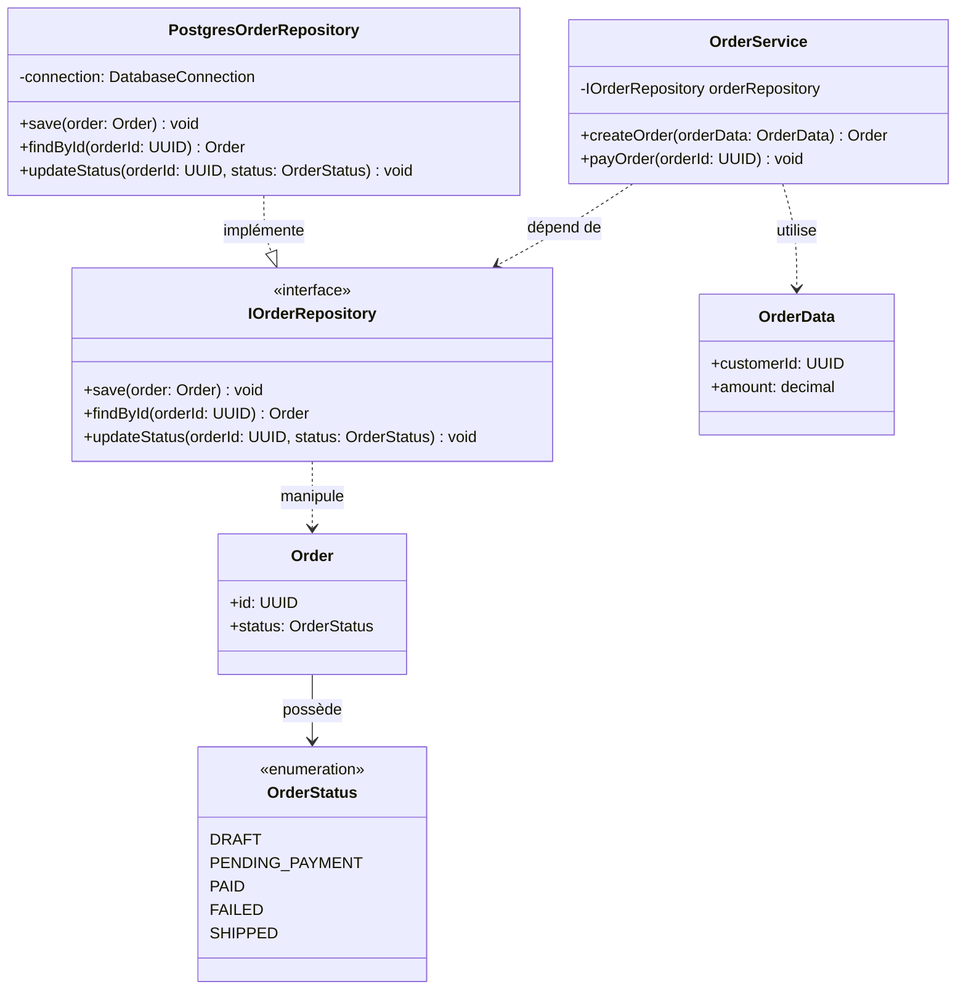

# Diagramme de Classes — Module de Paiement (MegaShop-B2B)

```mermaid
classDiagram
    class OrderService {
        -IOrderRepository orderRepository
        +createOrder(orderData: OrderData) Order
        +payOrder(orderId: UUID) void
    }

    class IOrderRepository {
        <<interface>>
        +save(order: Order) void
        +findById(orderId: UUID) Order
        +updateStatus(orderId: UUID, status: OrderStatus) void
    }

    class PostgresOrderRepository {
        -connection: DatabaseConnection
        +save(order: Order) void
        +findById(orderId: UUID) Order
        +updateStatus(orderId: UUID, status: OrderStatus) void
    }

    class Order {
        +id: UUID
        +status: OrderStatus
    }

    class OrderStatus {
        <<enumeration>>
        DRAFT
        PENDING_PAYMENT
        PAID
        FAILED
        SHIPPED
    }

    class OrderData {
        +customerId: UUID
        +amount: decimal
    }

    OrderService ..> IOrderRepository : dépend de
    PostgresOrderRepository ..|> IOrderRepository : implémente
    IOrderRepository ..> Order : manipule
    Order --> OrderStatus : possède
    OrderService ..> OrderData : utilise
```
