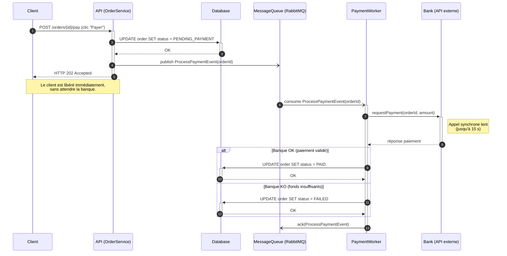

# Diagramme de Séquence — Flux de Paiement Asynchrone (MegaShop-B2B)

```mermaid
sequenceDiagram
    autonumber
    participant Client
    participant API as API (OrderService)
    participant Database
    participant MessageQueue as MessageQueue (RabbitMQ)
    participant Worker as PaymentWorker
    participant Bank as Bank (API externe)

    %% --- Phase synchrone : requête utilisateur ---
    Client->>+API: POST /orders/{id}/pay (clic "Payer")
    API->>+Database: UPDATE order SET status = PENDING_PAYMENT
    Database-->>-API: OK
    API-)MessageQueue: publish ProcessPaymentEvent(orderId)
    API-->>-Client: HTTP 202 Accepted

    Note over Client,API: Le client est libéré immédiatement,<br/>sans attendre la banque.

    %% --- Phase asynchrone : traitement en arrière-plan ---
    MessageQueue-)+Worker: consume ProcessPaymentEvent(orderId)
    Worker->>+Bank: requestPayment(orderId, amount)
    Note right of Bank: Appel synchrone lent<br/>(jusqu'à 15 s)
    Bank-->>-Worker: réponse paiement

    alt Banque OK (paiement validé)
        Worker->>+Database: UPDATE order SET status = PAID
        Database-->>-Worker: OK
    else Banque KO (fonds insuffisants)
        Worker->>+Database: UPDATE order SET status = FAILED
        Database-->>-Worker: OK
    end

    Worker-)-MessageQueue: ack(ProcessPaymentEvent)
```
