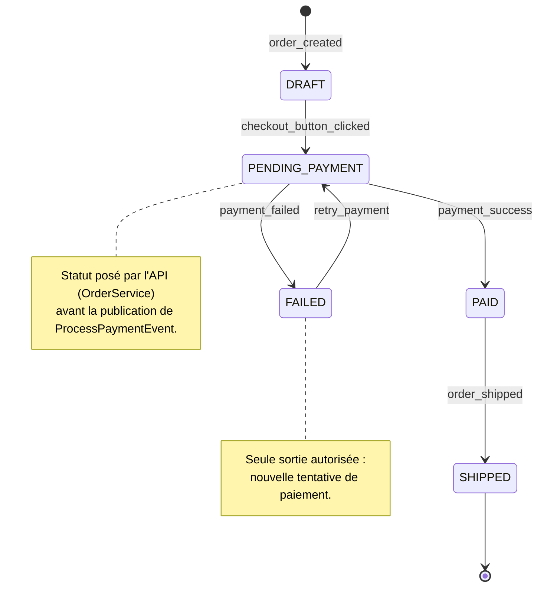

# Diagramme d'États-Transitions — Cycle de vie d'une Commande (MegaShop-B2B)

```mermaid
stateDiagram-v2
    [*] --> DRAFT : order_created

    DRAFT --> PENDING_PAYMENT : checkout_button_clicked

    PENDING_PAYMENT --> PAID : payment_success
    PENDING_PAYMENT --> FAILED : payment_failed

    FAILED --> PENDING_PAYMENT : retry_payment

    PAID --> SHIPPED : order_shipped

    SHIPPED --> [*]

    note right of PENDING_PAYMENT
        Statut posé par l'API (OrderService)
        avant la publication de ProcessPaymentEvent.
    end note

    note right of FAILED
        Seule sortie autorisée :
        nouvelle tentative de paiement.
    end note
```
